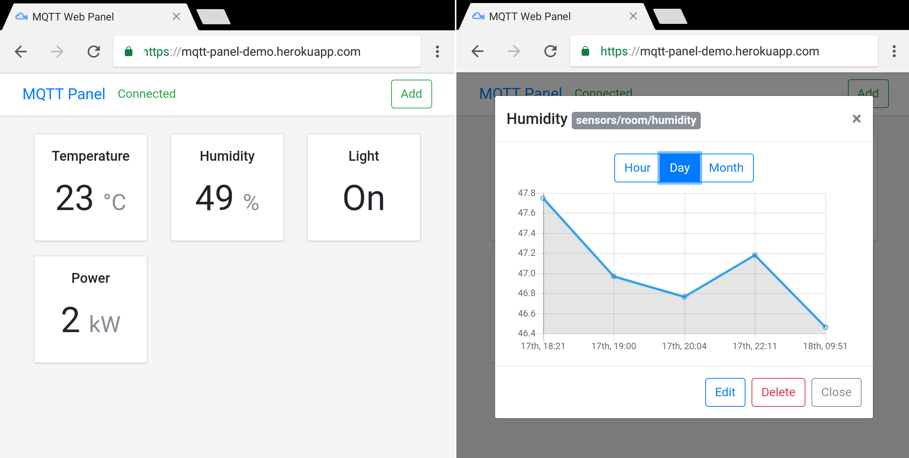

# MQTT Web Panel

Real-time web interface for MQTT.

[](https://travis-ci.org/mingruport/mqtt-web-panel)



---

## Demo

[Demo on Heroku](https://mqtt-panel-demo.herokuapp.com/).

## Features

- Real-time update data
- Displays statistics for the selected period
- Responsive interface
- RESTful API

## Requirements

- `Node.js >= 8.5`
- `MongoDB >= 3.4`

## Getting Started

### Install locally

```
git clone git@github.com:mingruport/mqtt-web-panel.git
cd mqtt-web-panel
npm install
npm start
```

Your app should be running on [localhost:3000](http://localhost:3000).

### Install on Raspberry Pi

Install Node.js:

```
$ sudo apt install nodejs
```

Check installation:

```
node -v
```

Install mqtt-web-panel:

```
git clone git@github.com:mingruport/mqtt-web-panel.git
cd mqtt-web-panel
npm install
npm start
```

### Deploying to Heroku

```
heroku create
git push heroku master
heroku open
```

[](https://heroku.com/deploy?template=https://github.com/mingruport/mqtt-web-panel)

### Testing

Execute this command to run tests:

```
npm test
```

## Environment variables

| Variable        | Default | Description            |
| --------------- | ------- | ---------------------- |
| `PORT`          | `3000`  | Port to run the API on |
| `MONGODB_URI`   | `-`     | Database URL           |
| `TIME_ZONE`     | `00:00` | Local time zone        |
| `MQTT_URL`      | `-`     | MQTT server URL        |
| `MQTT_PORT`     | `-`     | MQTT server port       |
| `MQTT_USERNAME` | `-`     | MQTT server username   |
| `MQTT_PASSWORD` | `-`     | MQTT server password   |

## API

- `GET /api/widgets/` Get all widgets.
- `GET /api/widgets/{id}` Get a single widget.
- `POST /api/widgets/` Create a new widget.
- `PUT /api/widgets/{id}` Update widget.
- `DELETE /api/widgets/{id}` Delete widget.

- `GET api/widgets/{id}/events&period={period}` Get widget events.

## License

This project is licensed under the MIT License.
